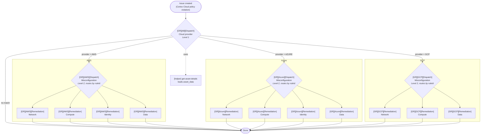
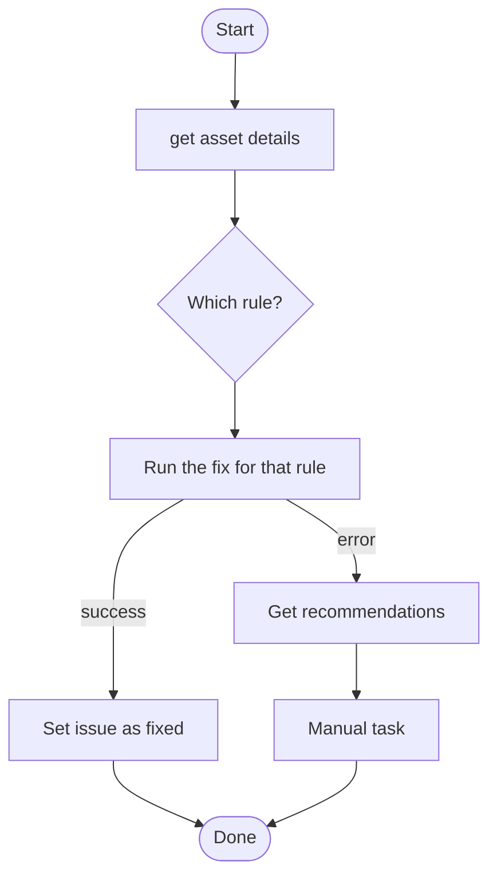

# Cortex Cloud Auto-Remediation Playbooks

Auto-remediation playbooks (XSOAR / Cortex playbook YAML) for **Cortex Cloud** misconfiguration
issues on **Azure**, **AWS** and **GCP**. Each issue raised by a Cortex Cloud policy is routed to the playbook
that fixes it. If the fix fails, the playbook fetches the issue recommendations and opens a manual task.

> **Status:** Review and test in a non-production tenant first.
> These playbooks change cloud resources (they disable firewall rules, change network access, and so on).

## How it works

Three levels of playbooks, all triggered with the issue's `ruleId`:

Every Level 3 (`Remediation`) playbook has the same internal flow:

Steps in a Level 3 playbook:

1. `[helper] get-asset-details` loads the asset into `asset_data`.
2. One condition task, *Evaluate triggered rule*, picks the fix by rule ID.
3. The action task calls the cloud integration (`Azure|||…`, `AWS|||…`, `GCP|||…`).
4. On success it sets the issue to *Resolved - Fixed*. On failure it runs *get Issue Recommendations*
   and then a *Manually update asset* task.
5. A few rules have no automated fix and go straight to step 4's manual path.

## Repository layout

| Path | Contents |
|---|---|
| `[GR][All][Dispatch]_Cloud_provider.yml` | Level 1 hub |
| `[helper]_get-asset-details.yml` | Shared helper sub-playbook |
| `azure-remediation/` | Azure dispatch + Network / Compute / Identity / Data |
| `aws-remediation/` | AWS dispatch + Network / Compute / Identity / Data |
| `gcp-remediation/` | GCP dispatch + Network / Compute / Data |
| `PLAYBOOKS.md` | Full guide: architecture, rule inventory, field mapping, gotchas, how to extend |

## Coverage

78 policy rules in total.

| Cloud | Rules | Categories | Notes |
|---|---|---|---|
| Azure | 42 | Network, Compute, Identity, Data | Reference implementation |
| AWS | 23 | Network, Compute, Identity, Data | Migrated to the same model, untested |
| GCP | 13 | Network, Compute, Data | Untested. The VM "block project-wide SSH keys" rule is manual (see the GCP pack note under Importing) |

The exact rule IDs and the fix for each one are listed in [`PLAYBOOKS.md`](PLAYBOOKS.md) §6.

## Naming and tags

Playbooks are named `[GR][<Cloud>][<Role>] <Scope>`:

- `GR`: **Guard Rail**. It marks every playbook that belongs to this auto-remediation set, which enforces the
  cloud guard rails (the policy baseline). Filtering by `GR` in Cortex lists only these playbooks and keeps
  them sorted together, apart from other playbooks in the tenant.
- `Cloud`: `All`, `AWS`, `Azure` or `GCP`
- `Role`: `Dispatch` (only calls other playbooks) or `Remediation` (changes a resource)
- `Scope`: `Cloud provider` (hub), `Misconfiguration` (Level 2) or `Network` / `Compute` / `Identity` / `Data`

Examples: `[GR][All][Dispatch] Cloud provider`, `[GR][Azure][Dispatch] Misconfiguration`,
`[GR][GCP][Remediation] Network`.

### Tags

Each playbook also carries tags, so it can be filtered in the playbook list. They repeat the bracket segments of
the name, and remediation playbooks add the category:

| Playbook | Tags |
|---|---|
| Hub | `GR`, `All`, `Dispatch` |
| Cloud dispatch (Level 2) | `GR`, `<Cloud>`, `Dispatch` |
| Category remediation (Level 3) | `GR`, `<Cloud>`, `Remediation`, `<Category>` |
| Helper | `helper` (it is shared, so it has no `GR` tag and keeps its own name) |

For example, `[GR][Azure][Remediation] Network` has the tags `GR`, `Azure`, `Remediation`, `Network`.

Files are named the same way, with spaces replaced by `_`.

## Importing into Cortex

1. Import the sub-playbooks first: the helper and the Level 3 remediation playbooks.
2. Import each cloud's Dispatch playbook, then the hub. A playbook task refers to its target by **exact name**,
   so the names must match.
3. Do not change a playbook's `id:`. Cortex uses it to update in place instead of creating a duplicate.
4. Attach the hub playbook to the issue-creation trigger you use for auto-remediation.

Requirements: the AWS, Azure and GCP integration packs installed and configured. Command availability depends
on the pack version, so check your tenant's command list (`!gcp-` in the War Room) before relying on them.
The GCP playbooks were written against an older GCP pack: buckets are fixed with
`gcp-storage-bucket-policy-delete`, and the VM SSH-keys rule is manual because `gcp-compute-instance-metadata-set`
(pack 1.7.0+) is missing. With a newer pack, `gcp-storage-bucket-public-access-block` (1.4.0+) is a better fix
for the bucket rules.

## Extending

`PLAYBOOKS.md` §10 has step-by-step instructions to add a rule, add a category and validate a change,
including the exact asset field paths (`asset_data.xdm__asset__raw_fields.Platform Discovery.<field>`) already
verified for each resource type.

## Safety notes

- Several fixes are intentionally aggressive: GCP firewall rules are **disabled** rather than edited, GKE
  master authorized networks are enabled **without CIDRs**, and AWS/Azure actions modify live resources.
- Playbooks stop silently for an issue that does not have exactly one asset.
- Never commit tenant exports, war-room output or pasted assets: they can contain secrets such as VM metadata.
